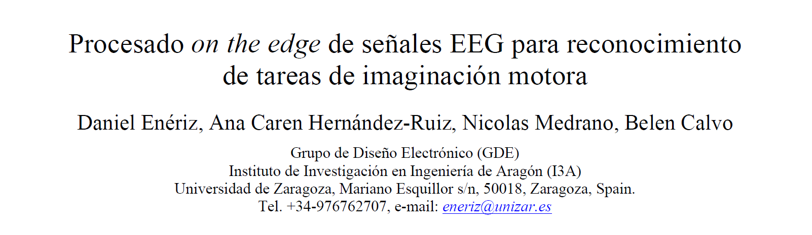

Aquí está el material de apoyo para la presentación del póster del trabajo __"Procesado _on the edge_ de señales EEG para reconocimiento de tareas de imaginación motora"__, de Daniel Enériz, Ana Caren Hernández-Ruiz, Nicolás Medrano y Belén Calvo. Este trabajo es uno de los presentados en la __X Jornada de Jóvenes Investigadores del I3A__ (Instituto Universitario de Investigación en Ingeniería de Aragón).

## Contacto

- [Daniel Enériz](https://orcid.org/0000-0001-5709-1183) (Investigador predoctoral) [eneriz@unziar.es](mailto:eneriz@unizar.es)
- [Ana Caren Hernández-Ruiz](https://orcid.org/0000-0001-6318-6162) (Investigadora predoctoral) [anaacaren@unizar.es](mailto:anaacaren@unizar.es)
- [Nicolás Medrano](https://orcid.org/0000-0002-5380-3013) [nmedrano@unizar.es](mailto:nmedrano@unizar.es)
- [Belén Calvo](https://orcid.org/0000-0003-2361-1077) [becalvo@unizar.es](mailto:becalvo@unizar.es)

Los cuatro autores pertenecen al Grupo de Diseño Electrónico (GDE) del I3A y con despachos en la Facultad de Ciencias de Unizar.

## Material

### Poster

### Resumen

### Código

Hay una publicación del código usado en este trabajo en este repositorio
[MIBCI-QCNNs](https://github.com/eneriz-daniel/MIBCI-QCNNs){: .btn }
